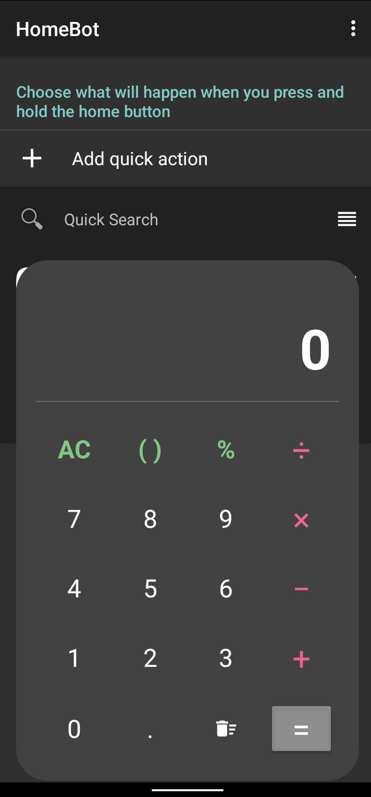

# 🤖 HomeBot Assistant Enhancer

[](https://kotlinlang.org)
[](https://developer.android.com)
[](LICENSE)

**HomeBot** is a powerful Android utility that allows you to reclaim your assistant gesture (typically a long-press on the home button or a corner swipe) to trigger custom, context-aware actions.

This project is a modern fork of [kklorenzotesta/homebot](https://github.com/kklorenzotesta/homebot)

---

## 🚀 Key Features

- **⚡ Instant Actions**: Launch apps, activities, or system shortcuts with a single gesture.
- **🔍 Quick Search Overlay**: A native, lightning-fast floating search bar to find apps and search the web without leaving your current app.
- **🧮 Integrated Calculator**: Quickly perform calculations directly within the assistant overlay.
- **🛠️ Grid Launcher**: Configure multiple actions and access them through an elegant, customizable grid menu.
- **🔦 System Toggles**: Fast access to flashlight, brightness, and recent apps.
- **📂 Folders**: Organize your actions into logical groups for even more flexibility.

---

## 📸 Screenshots

| Settings & Config | Quick Search Overlay | Action Launcher | Actions | Calculator Overlay |
| :---: | :---: | :---: | :---: | :---: |
|  |  |  |  |  |

---

## 🛠️ Setup Instructions

To get HomeBot working as your primary assistant, follow these steps:

1. **Install** the latest APK from the [Releases](https://github.com/diekaiju/homebot/releases/) page.
2. Open **System Settings**.
3. Navigate to **Apps > Default apps > Assist & voice input** (the path may vary slightly by device).
4. Select **HomeBot** as your **Digital assistant app**.
5. Launch the HomeBot app to configure your desired actions.

> [!NOTE]
> Some advanced features like **Quick Search** and **Brightness Toggle** require additional permissions (Overlay / System Settings) which you will be prompted to grant during setup.

---

## ⚠️ Known Limitations

- **Pixel Devices**: Setting a custom assistant may disable "Active Edge" (squeeze for Google Assistant).
- **MIUI/ColorOS**: Ensure "Auto-start" and "Display pop-up windows" are enabled for HomeBot in system settings for consistent behavior.

---

## 🏗️ Development

HomeBot is built with modern Android practices:
- **Language**: 100% Kotlin
- **Build System**: Gradle 8.x
- **Serialization**: Jackson for persistence
- **Architecture**: Lightweight, modular design

To build locally:
```bash
./gradlew assembleDebug
```

---

## 🤝 Acknowledgements

Special thanks to the original creators whose work made this possible:
- [kklorenzotesta/homebot](https://github.com/kklorenzotesta/homebot) - The original core project.

---

## 📄 License

This project is licensed under the **MIT License**. See the [LICENSE](LICENSE) file for details.
